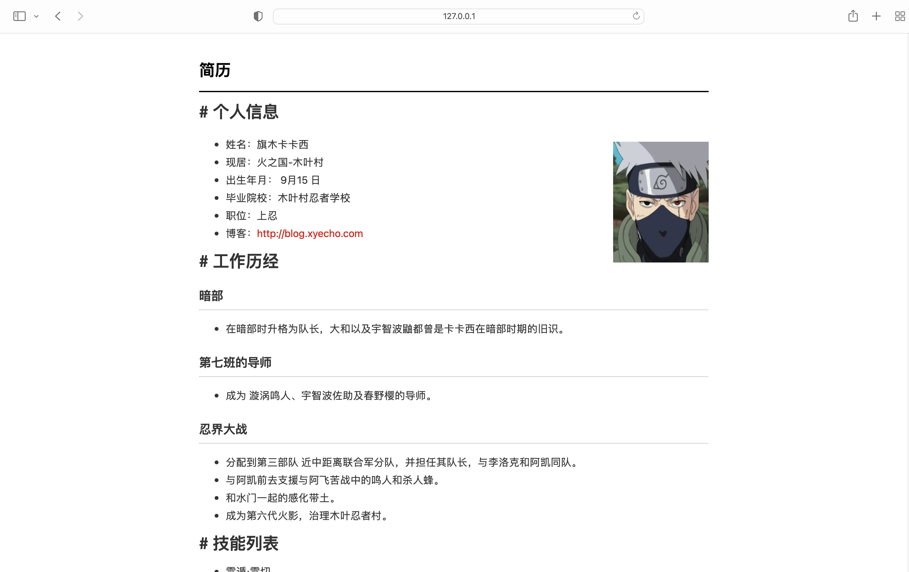

# IT 工程师简历 

<p align="center">
  
</p>

<p align="center">
  
  
  
</p>


## 简介


极简风格的响应式简历模板，基于 [Jekyll](http://jekyllrb.com/)。可以直接部署在 GitHub Pages 上。

通过 `markdown` 方式写简历，再通过 Jekyll 的主题呈现出来。 


## 特点

- 简单、清晰、极简的设计。 
- 支持输出 PDF 并且打印机友好

## 使用

1. 克隆（可以先 fork）

   ```shell
   git clone https://github.com/kakabei/work-resume.git
   ```

2. 安装 Jekyll

   见官网：[http://jekyllrb.com](http://jekyllrb.com/)

3. 简历相关位置

  - markdown : `_post/2022-12-07-information.md`
  - 图片 : `images/`
  - 配置 : `_conifig.yml`

4. 运行和预览

   ```shell
   bundle exec jekyll server
   ```


## 联系信息
 
- [about tme](about.md)
- you can visit my blog : [blog.xyecho.com](http://blog.xyecho.com).

## 协议

[](/LICENSE)
